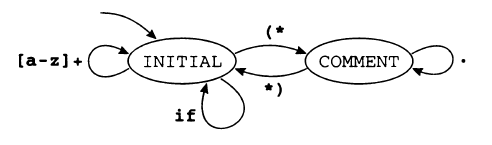

# Lexical Analysis

### Definition:
Breaking the input into individual words or `tokens`.
The lexical analyzer takes a stream of characters and produces a stream of names, kywords, and punctuation marks; it discards white space and comments between the tokens.

### Lexical Tokens:
A lexical token is a sequence of characters that can be treated as a unit in the grammar of a programming language.

Examples of non-tokens are:
1. **comment** : /* try again */
2. **preprocessor directive** : #include<stdio.h>
3. macros, blanks, tabs, and newlines

We will specify lexical tokens using the formal language of regular expressions, implement lexers using deterministic finite automata, and use mathematics to connect the two, which leads to simpler and more readable lexical analyzers.

### Regular Expressions:
A language is a set of *strings*, where a *string* is a finite sequence of *symbols*. The symbols themselves are taken from a finite *alphabet*. Almost always, the alphabet is the ASCII character set. To specify the computer programming languages (possibly infinite) with finite descriptions, we will use the notation of *regular expressions*. Each regular expression stands for a set of strings.

Using symbols, alternation, concatenation, epsilon, and Kleene closure we can specify the set of ASCII characters corresponding to the lexical tokens of a programming language.

Examples:
- (0 | 1)*.0    Binary numbers that are multiples of two.
- b*(abb*)*(a|ϵ)    String of a's and b's with no consecutive a's.

**Extended Regular Expression**
- M? = (M|ϵ)
- M+ = (M.M*)

**Regular Expressions for some Tokens**
- if ⤍ 
- [a-z][a-z0-9]* ⤍
- [0-9]+ ⤍
- ( [0-9]+"."[0-9]* )|( [0-9]*"."[0-9]+) ⤍ (REAL);

**Rule of Longest Match:** The longest initial substring of the input that can match any regular expression is taken as the next token.

**Rule of Priority:** For a particular longest initial substring, the first regular expression that can match detemines its token type. This means that the order of writing down the regular-expression rules has signigicance.

Thus, a string "if8" matches as an identifier by the longest-match rule, and a string "if" matches as a reserved word by rule-priority.

One can easily make a DFA to tell whether a string is in a language or not. But the job of a lexical analyzer is to find the longest match, the longest initial substring of the input that is a valid token. Keeping track of the longest match just means remembering the last time the automaton was in a final state with two variables, `Last-Final` (the state number of the most recent final state encountered) and `Input-Position-at-Last-Final`. Every time a final state is entered, the lexer updates these variables; when a dead state (a nonfinal state with not output transitions) is reached, the variables tell what token was matched, and where it ended.

### ML-Lex: A lexical analyzer generator

ML-Lex is a lexical generator that produces an ML program from a lexical specification. For each token type in the programming language to be lexically analyzed, the specification contains a regular expression and an *action*.

```
(* ML Declarations: *)
    type lexresult = Tokens.token
    fun eof() = Tokens.EOF (0,0)
    %%
(* Lex Definitions: *)
    digits = [0-9]+
    %%
(* Regular Expressions and Actions: *)
    if              =>  (Tokens.IF(yypos, yypos + 2));
    [a-z][a-z0-9]*  =>  (Tokens.ID(yytext, yypos, yypos + size yytext));
    {digits}        =>  (Tokens.NUM(Int.fromString yytext, yypos, 
                                            yypos + size yytext));
    ({digits}"."[0-9]*)|([0-9]*","{digits})
                    =>  (Tokens.REAL(Real.fromString yytext, yypos, 
                                            yypos + size yytext));


    ("--"[a-z]*"\n")|(" "|"\n"|"\t")+
                    =>  (continue());
                    =>  (ErrorMsg.error yypos "illegal character";
                        continue());
```

The first part of the specification, above the first `%%` mark, contains functions and types written in ML. These must include the type `lexresult`, which is the result type of each call to the lexing function; and the function `eof`, which the lexing engine will call at end of file. This section can also contain utility functions for the use of semantic actions in the third section. 

The second part of the specification contains regular-expression abbreviations and state declarations.

The third part contains regular expressions and actions. The actions are fragments of ordinary ML code. Each action must return a value of type `lexresult`. In this specification, `lexresult` is a token from the `Tokens` structure.

In the action fragments, several special variables are available. The string matched by the regular expression is `yytext`. The file position of the beginning of the matched string is `yypos`. The function `continue()` calls the lexical analyzer recursively.

In this particular example, each token is a data constructor parametrized by two integers indicating the position - in the input file - of the beginning and end of the token.

```
structure Tokens = 
struct 
    type pos = int
    datatype token  =   EOF of pos * pos
                    |   IF of pos * pos
                    |   ID of string * pos * pos
                    |   NUM of int * pos * pos
                    |   REAL of real * pos * pos
                        :
                        :
                        :
end
```

Thus, it is appropriate to pass `yypos` and `yypos + size yytext` to the constructor. For tokens like ID's *semantic values* are associated with them.


### Start States

> Regular expressions are *static* and *declarative*; automata are *dynamic* and *imperative*.

ML-Lex has a mechanism to mix states with regular expressions. One can declare a set of *start states*; each regular expression can be prefixed by the set of start states in which it is valid. The action fragments can explicitly change the start state. In effect, we have a finite automaton whose edges are labeled, not by single symbols, but by regular expression. This example shows a language with simple identifiers, `if` tokens, and comments delimited by (* and *) brackets:



Though it is possible to write regular expression that matches an entire comment, as comments get more complicated it becomes more difficult, or even impossible if nested comments are allowed.

The ML-Lex specification corresponding to this machine is

```
    :
    :
%%
%s COMMENT
%%
<INITIAL>if     =>  (Tokens.IF(yypos, yypos + 2));
<INITIAL>[a-z]+ =>  (Tokens.ID(yytext, yypos, 
                        yypos + size yytext));
<INITIAL>"(*"   =>  (YYBEGIN COMMENT; continue());
<COMMENT>"*)"   =>  (YYBEGIN INITIAL; continue());
<COMMENT>.      =>  (continue();)
```

where `INITIAL` is the start state, provided by default in all specfications. Any regular expression not prefixed by a <STATE> operates in all states; this feature is rarely useful.