# Parsing

## Context-free Grammars

A _language_ is a set of _strings_; each string is a finite sequence of _symbols_ taken from a finite _alphabet_. For parsing, the srings are source programs, the symbols are lexical tokens, and the alphabet is the set of token types returned by the lexical analyzer.

A __CFG__ grammar describes a language. A grammar has a set of _productions_ of the form:

* _symbol_ --> _symbol_ _symbol_ ... _symbol_

where there are zero or more symbols on the right-hand side. Each symbol is either _terminal_, meaning that it is a token from the alphabet of strings in the language, or _nonterminal_, meaning that it appears on the left-hand side of some production. No token can ever appear on the left-hand side of a production. Finally, one of the nonterminals is distinguished as the _start symbol_ of the grammar.

### Derivations

There are many different derivation of the same sentence. A _leftmost_ derivation is one in which the leftmost nonterminal symbol is always the one expanded; in a _rightmost_ derivation, the rightmost nonterminal is always next to be expanded.

### Parse Trees

A _parse tree_ is made by connecting each symbol in a derivation to the one from which it was derived. Two _different_ derivations can hace the same parse tree.

### Ambiguous Grammar

A grammar is _ambiguous_ if it can derive a sentence with two different parse trees. In compiler design we like to deal with _unambiguous_ grammar or a grammar which can be easily transformed to _unambiguous_ grammar.

The grammar given below grammar is ambiguous:

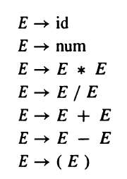

Let us find an unambiguous grammar that accepts the same language as above grammar. 

1. `*` _binds tighter_ than `+`, or has __higher precedence__.
2. Each operator _associates to the left_.

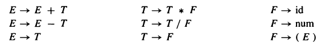

Note: Not all ambiguous grammar can be converted to unambiguous grammar.

### End-Of-File Marker

We will use `$` to represent end of the file. Suppose `S` is the start symbol of the grammar. To indicate that `$` must come after a complete `S-phrase`, we augment the grammar with a new start symbol `S'` and a new production `S' --> S$`.

## Predictive Parsing - Recursive Descent

Some grammars are easy to parse using a simple algorithm known as recursive descent. In essence, each grammar production turns into one clause of a recursive function. A recursive-descent parser for the language given below has one function for each non-terminal and one clause for each production.

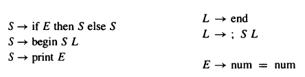


```
datatype token  = IF
                | THEN
                | ELSE
                | BEGIN
                | END 
                | PRINT
                | SEMI 
                | NUM
                | EQ

val tok = ref (getToken())

fun advance() = tok := getToken()

fun eat(t) = if (!tok = t) then
                advance()
            else error()

fun S() = case !tok
            of IF => (eat(IF); E();
                        eat(THEN);
                        S();
                        eat(ELSE);
                        S())
            | BEGIN => (eat(BEGIN);
                        S(); L())
            | PRINT => (eat(PRINT); E())
and L() = case !tok
            of END => (eat(END))
            | SEMI => (eat(SEMI); S(); L())
and E() = (eat(NUM); eat(EQ); eat(NUM))
```

With suitable definitions of `error` and `getToken`, this program will parse very nicely.

Let us try it with _unabiguous_ grammar given in previous section. 

```
fun S()	= (E(); eat(EOF))
and E()	= case !tok 
	   of ? => (E(); eat(PLUS); T())
	   |  ? => (T(); eat(MINUS); T())
	   |  ? => (T())
and T()	= case !tok
	   of ? => (T(); eat(TIMES); F())
	   |  ? => (T(); eat(DIV); F())
	   |  ? => (F())
and F() = case !tok
	   of ID => (eat(ID))
	   |  NUM => (eat(NUM))
	   |  LPAREN => (eat(LPAREN); E(); eat(RPAREN))
```

There is a *conflict* here: the `E` function has no way to know which clause to use. Consider the strings `(1*2-3)+4` and `(1*2-3)`. In the former case, the initial call to `E` should use the `E -> E + T` production, but the latter case should use `E -> T`.

Recursive-descent, or *predictive*, parsing works only on grammars where the *first terminal symbol* of each subexpression provides enough information to choose which production to use. To understand this better, we will formalize the notion of **FIRST** sets, and then derive conflict-free recursive-descent parsers using a simple algorithm.

## First & Follow Sets

Given a string **𝛾** of terminal and nonterminal symbols, **FIRST(𝛾)** is the set of all terminal symbols that can begin any string derived from 𝛾. eg., FIRST(𝛾) = { id, num, ( }

If two different productions **X -> 𝛾~1~** and **X -> 𝛾~2~** have the same left-hand-side symbol (X) and their right-hand sides have **overlapping FIRST sets**, then grammar cannot be parsed using predictive parsing. 

Consider following grammar:

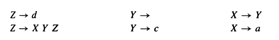 

If *𝛾 = X Y Z*, then it seems FIRST(𝛾) is FIRST(X) but accounting the fact that X and Y are symbols which can produce empty string - we find that FIRST(XYZ) must include FIRST(Z). 

Hence, FIRST(𝛾) = FIRST(X) ∪ FIRST(Y) ∪ FIRST(Z)

With respect to a particular grammar, given a string 𝛾 of terminals and nonterminals,

- nullable(X) is true if X can derive the empty string.
- FIRST(𝛾) is the set of terminals that can begin strings derived from 𝛾.
- FOLLOW(X) is the set of terminals that can immediately follow X. That is, t ∊ FOLLOW(X) if there is any derivation containing Xt. This can occur if the derivation contains XYZt where Y and Z both derive ϵ.

### Precise definition of FIRST, FOLLOW, and nullable

A precise definition of FIRST, FOLLOW and nullable is that they are the smallest sets for which these properties hold:

```
for each terminal symbol Z, FIRST[Z] = {Z}
for each production X -> Y1 Y2 ... Yk
	if Y1 Y2 ... Yk are all nullable (or if k = 0)
		then nullable[X] = true
	for each i from 1 to k, each j from i+1 to k
		if Y1 ... Y(i-1) are all nullable (or if i = 1)
			then FIRST[X] = FIRST[X] ∪ FIRST[Yi]
		if Y(i+1) ... Yk are all nullable (or if i = k)
			then FOLLOW[Yi] = FOLLOW[Yi] ∪ FOLLOW[X]
		if Y(i+1) ... Y(j-1) are all nullable (or if i + 1 = j)
			then FOLLOW[Yi] = FOLLOW[Yi] ∪ FIRST[Yj]
```

Hence, algorithm to compute FIRST, FOLLOW and nullable can be derived from above rule.

```
INITIALIZE FIRST and FOLLOW to all empty sets, and nullable to all false.

for each terminal symbol Z
	FIRST[Z] <- {Z}
repeat
	for each production X -> Y1 Y2 ... Yk
		if Y1 Y2 ... Yk are all nullable (or if k = 0)
			then nullable[X] <- true
		for each i from 1 to k, each j from i+1 to k
			if Y1 ... Y(i-1) are all nullable (or if i = 1)
				then FIRST[X] <- FIRST[X] ∪ FIRST[Yi]
			if Y(i+1) ... Yk are all nullable (or if i = k)
				then FOLLOW[Yi] <- FOLLOW[Yi] ∪ FOLLOW[X]
			if Y(i+1) ... Y(j-1) are all nullable (or if i + 1 = j)
				then FOLLOW[Yi] <- FOLLOW[Yi] ∪ FIRST[Yj]
until FIRST, FOLLOW, and nullable did not change in this iteration.
```

## Constructing a Predictive Parser

Consider a recursive-descent parser. The parsing function for some nonterminal X has a clause for each X-production; it must choose one of these clauses based on the next token T of the input. If we can choose the right production for each (X,T), then we can write the recursice-descent-parser. All the information we need can be encoded as a two-dimensional table of productions, indexed by nonterminals X and terminals T. This is called a predictive parsing table. 

To construct this table, enter production X -> 𝛾 in row X, column T of the table for each T ∊ FIRST(𝛾). Also, if 𝛾 is nullable, enter the production in row X, column T for each T ∊ FOLLOW[X].

Consider the predictive parsing table for grammar discussed above:

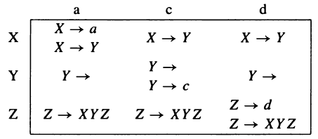 

Some of the entries contain more than one production. The presence of duplicate entries means that predictive parsing will not work on this grammar.

The above grammar is ambiguous. The sentence d has many parse trees, including:

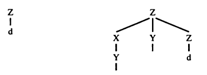 

> An ambiguous grammar will always lead to duplicate entries in a predictive parsing table. Grammars whose predictive parsing tables contain no duplicate entries are called **LL(1)**. This stands for *Left-to-right parese, Leftmost-derivation, 1-symbol lookahead*. 

The order in which a predictive parser expands nonterminals into right-hand sides is just the order in which a lefrmost derivation expands nonterminals. And a recursive descent parser does its job just by looking at the next token of the input, never looking more than one token ahead.

We can generalize the notion of FIRST sets to describe the first k tokens of a string, and to make an LL(k) parsing table whose rows are the nonterminals ans columns are every sequence of k terminals.

> No ambiguous grammar is LL(k) for any k.


### Eliminating left recursion

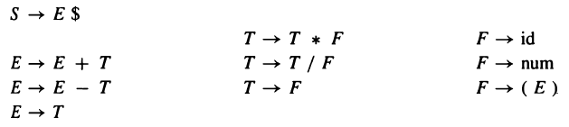

Suppose we want to build a predictive parser for above grammar. The two productions:

```
E -> E + T
E -> T
```

are certain to cause duplicate entries in the LL(1) parsing table, since any token in FIRST(T) will also be in FIRST(E+T). The problem is that E appears as the first right-hand-side symbol in an E-production; this is called **left recursion**. 

> **Grammars with left recursion cannot be LL(1).**

To eliminate left recursion, we will rewrite using right recursion. We introduce a new nonterminal E', and write

```
E -> T E'

E' -> + T E'
E' -> ϵ
```

This derives the same set of strings (on T and +) as the original two productions, but now there is no left recursion.

In general, whenever we have productions X -> X𝛾 and X -> α where α does not start with X, we know that this derives strings of the form α𝛾*, an α followed by zero or more 𝛾. So we can reqrite the regular expression using right recursion:

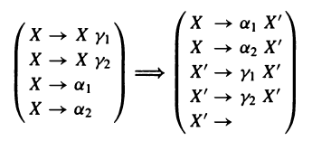

Applying this transformation we obtain following grammar:

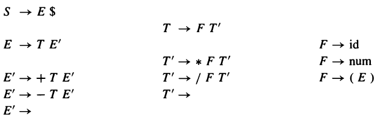

To build a predictive parser, first we compute nullable, FIRST and FOLLOW.

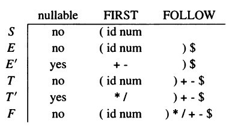

The predictive parser for this grammar is given below. We omit the columns for num, /, and -, as they are similar to others in the table.

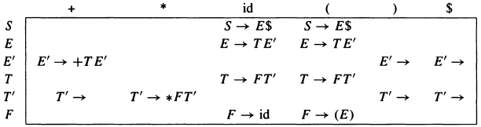

### Left Factoring

We have seen that left recursion interferes with predictive parsing, and that it can be eliminated. A similar problem occurs when two productions for the same nonterminal start with the same symbols. For example:

```
S -> if E then S else S
S -> if E then S
```

In such a case, we can left factor the grammar - that is, take the allowable endings ("else S" and ϵ) and make a new nonterminal X to stand for them:

```
S -> if E then S X
X -> ϵ
X -> else S
```


